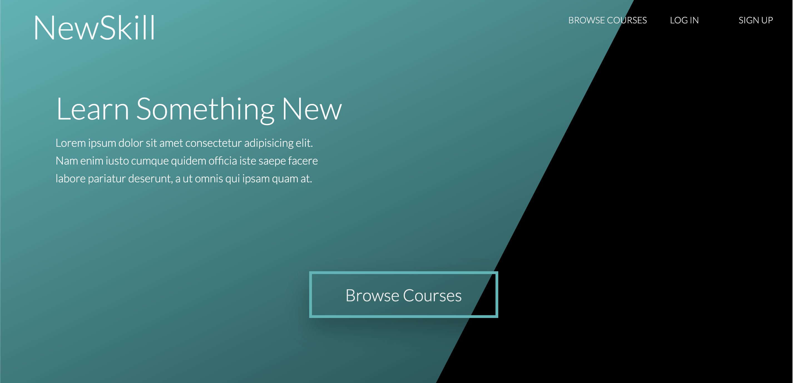
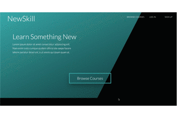
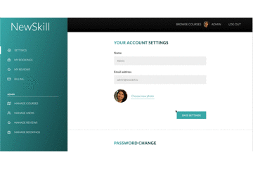

# NewSkill

</img>

<b>NewSkill's purpose</b>: The purpose of NewSkill is to provide individuals an easy to use site that contains a variety of 
different classes available for registration and booking. The classes listed are held at different locations around 
Houston, TX and offer in-person instruction for an individual to learn and develop a new skill. The site is designed 
to allow for new user registration, login, booking, and payment for the selected class.

<b>How to use NewSkill</b>: Potential course takers are greeted by the homepage where they can browse the offered courses
before creating an account. Each course is shown on its own card, and lists some quick facts about it. To 
get more information or book a course, users will click on the "Course Details" link found on each course card. This page 
contains more information about the course such as, a full description of what will be covered, the instructor, 
a map showing where exactly it will be held, reviews from previous students, and an option to book the course. Once an 
individual has found a class or classes they're interested in, they can simply go the "Sign Up" link and create a new account. 
After registration, users are automatically logged in, and redirected to the courses page. Booking and making payment
for a course is then just one click away with the "Book Course" button found at the bottom of the details page. Registered users of the site are
able to update their settings such as, their profile picture, password, email, and name. Users are also able to see the 
courses they have booked through the user portal. Logging in as an admin allows access to managaing all users, 
courses, reviews, and bookings. 

<b>NewSkill's features</b>: The website is featured with a creative and modern design with featured courses changing every 
other week, and offers quick facts about each course offered before going to the "Course Details" page. The site differentiates
between logging in, registration, and offers security for the user by creating an encrypted password when they register, 
and sends them a JWT once logged in. Only users who are logged in are able to book a course and update their settings. 

<h2> Live Link to Site </h2> 
https://newskillsite.herokuapp.com/

<h2> Browsing Courses </h2> 
</img>

<h2> Course Details </h2>
</img>

<h2> Admin Login </h2>
</img>

<h2> Updating Settings </h2>
</img>

<h2> Booking a Course </h2> 
</img>

<h2> Admin Login Credentials </h2>
username: admin@newskill.io |
password: test1234

<h2> Database </h2>
The database used for this project was MongoDB with the ODM (Object Data Modeling) library, Mongoose.

<h2> Programs & API Used </h2> 
JavaScript, Node.js, HTML, CSS, Pug, and Mapbox API. 

<h2> Team Members </h2>
This application was created by <a href='https://github.com/taliaa10'>Taliaa Tauatolo</a>, 
<a href='https://github.com/TonyTcode'>Antonio Tobar</a>, <a href='https://github.com/carinevic'>Carine Ngwekwe</a>,
and <a href='https://github.com/Umreen24'>Umreen Imam</a>.
